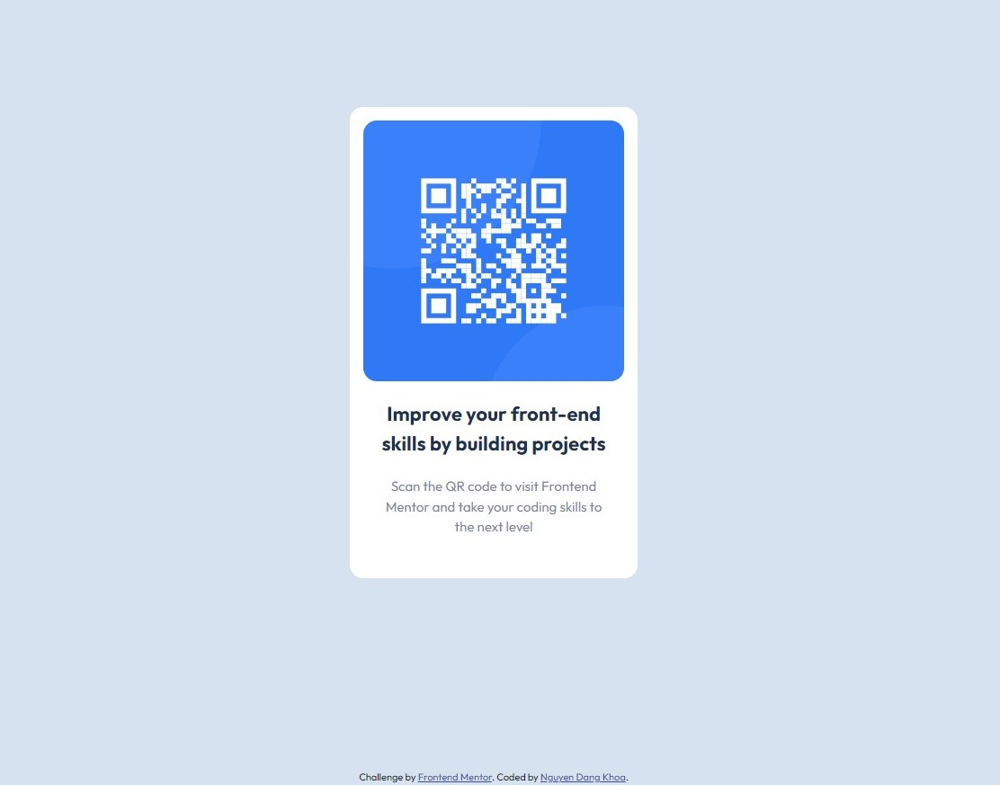

# Frontend Mentor - QR code component solution

This is a solution to the [QR code component challenge on Frontend Mentor](https://www.frontendmentor.io/challenges/qr-code-component-iux_sIO_H). Frontend Mentor challenges help you improve your coding skills by building realistic projects.

### The challenge

Build out this QR code component and get it looking as close to the design as possible.

### Screenshot

### Links

- Solution URL: [Solution URL here](https://github.com/dangkhoa1195/qr-code-component)
- Live Site URL: [Live site URL here](https://dangkhoa1195.github.io/qr-code-component/)
